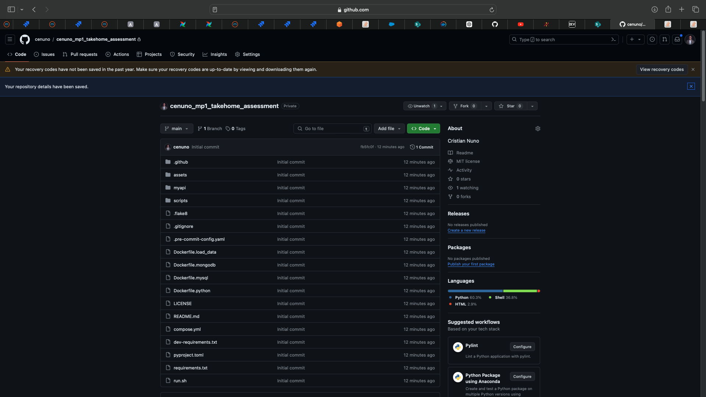
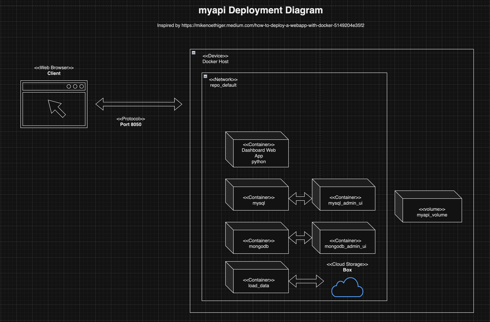

# Take Home Assessment for Data Engineer I

Welcome to the Take Home Assessment for the Data Engineer I role at mPulse!


The team is grateful for your time in showing us your skillset. Below you will find both the goals of the take home assessment.

## Goal

This assessment will evaluate your ability to handle data from different sources, use Docker for environment setup, perform data manipulation using Python, and develop an API using Python.

This take home assessment is meant to be completed in 4 hours. To aid this development, all data infrastructure has been provided for you so that you can focus on the objectives listed below. 


## Objectives

* Follow the `Instructions` below to make sure you have your private GitHub repo uploaded with the base files necessary to complete the objectives listed below
    + Time estimate: 10 minutes
* Confirm that the two databases connect successfully using the `myapi/test_db_connections.py` file
    + You should see a `myapi/logs/test_db_connections.log` file if done successfully. Its contents should look like this:
    ```text
    INFO:06/22/2024 01:57:59.320: connection to mysql db successful!
    ...
    INFO:06/22/2024 01:57:59.329: connection to mongodb is successful
    ```
    + This `.log` file will not be version controlled. This is on purpose.
    + Time estimate: 10 minutes
* There is a group of 31 professors that we must message via SMS. Before we can do this, we need to have a clean, standardized phone number to use.
    + Using the professors found in `myapi/queries/distinguished_professors.sql`, please create a `myapi/clean_phone_numbers.py` file that:
        + Reads in the query output
        + Parses each `phone` value so that the end result is, for each value a 11-digit integer with leading a leading `1`. When there is no phone number, ensure no value is returned.
        + Create a pipe delimited CSV file that returns two columns: `faculty_id` and `clean_phone`. Store this file within `myapi/data/clean_phone_numbers_YYYYMMDD_HHmmss.csv`
            + The timestamp suffix cannot be hard coded. It must be dynamically generated each time.
                + `YYYY` is 4-digit year
                + `MM` is 2-digit month
                + `DD` is 2-digit day
                + `HH` is 2-digit hour using 24 hour time
                + `mm` is 2-digit minute
                + `ss` is 2-digit seconds
            + The timestamp must be in the `'America/Los_Angeles'` timezone.
        + This `.csv` file will not be version controlled. This is on purpose.
        + Time estimate: 40 minutes
* Create a Python RESTful API with endpoints that achieve the following:
    + The endpoints within your API must be accessible via `http://localhost:8050/api/` as defined in `myapi/app.py`
    + You must use the [Connexion module](https://connexion.readthedocs.io/en/latest/index.html), which allows a Python program to use the [OpenAPI](https://www.openapis.org/) specification with [Swagger](https://swagger.io/docs/specification/about/).
        + See `myapi/swagger.yml` for an example Swagger YAML file that has been provided for you.
        + The team will also be looking at your endpoints via http://localhost:8050/api/ui/
    + Create data by inserting a new record into the `keyword` table within the MySQL database by way of `/keyword-endpoint` endpoint
        + Teammates should be able to run `curl -X POST -H "Content-Type: application/json" -d '<DATA>' http://localhost:8050/api/keyword-endpoint` and see that the `POST` request was successful where `<DATA>` is replaced with relevant data for the body of the request.
    + Read data by fetching one or more records that satisfy criteria
        + From the MySQL database, find the faculty that published more than 10 publications in a particular year who were also cited more than 10 times per publication.
            + For each document returned, please ensure they have three keys sorted in descending order of `num_publications`: `faculty_id`, `faculty_name`, and `num_publications`.
            + The particular year must be 4-digit integer passed via a parameter into this `GET` request.
            + Please call this endpoint `/faculty-top-cited/{year}`
            + Teammates should be able to run `curl -X GET http://localhost:8050/api/faculty-top-cited/<YEAR>` and see that the `GET` request was successful where `<YEAR>` is replaced with relevant 4-digit integer.
       + From the mongodb, find the top-10 most popular keywords among publications that were published between an inclusive start year and an inclusive end year.
           + Both the start date and end date will be 4-digit integers passed via parameters into this `GET` request.
           + You may assume that the keyword name is unique for each keyword. 
           + For each document returned, please ensure they have three keys sorted in descending order of `publicationsCount`: `keywordName` and `publicationsCount`.
           + This data should be retrievable from within the `/keyword-endpoint` endpoint
           + Teammates should be able to run `curl -X GET http://localhost:8050/api/keyword-endpoint?startDate=<startDate>&endDate=<endDate>` and see that the `GET` request was successful where the two query parameters are replaced with relevant 4-digit integers.
    + Update data by modifying an existing record in the `keyword` table within the MySQL database by way of `/keyword-endpoint` endpoint
        + Teammates should be able to run `curl -X PUT -H "Content-Type: application/json" -d <DATA> http://localhost:8050/api/keyword-endpoint` and see that the `PUT` request was successful where `<DATA>` is replaced with relevant data for the body of the request.
    + Delete data by removing an existing record in the `keyword` table within the MySQL database by way of `/keyword-endpoint` endpoint
        + Teammates should be able to run `curl -X DELETE -H "Content-Type: application/json" -d <DATA> http://localhost:8050/api/keyword-endpoint ` and see that the `DELETE` request was successful where `<DATA>` is replaced with relevant data for the body of the request.
    + Time estimate: 2 hours and 50 minutes
* Create a `NOTES.md` file where you write a summary of the work you produced for the team. 
    + Have at least one bullet for each task you did and did not get to
    + Time estimate: 10 minutes

## Instructions:

1. Sign into Github

2. Create a [new private repo](https://docs.github.com/en/repositories/managing-your-repositorys-settings-and-features/managing-repository-settings/setting-repository-visibility#changing-a-repositorys-visibility) called `<github_username>_mp_takehome_de1`.
    + Add your first and last name to the `Description` text box
    + Do not initialize the repository with anything
        + No `README.md`
        + No `.gitignore`
        + No `LICENSE`

3. Add the following GitHub ID to your repository as [collaborators](https://docs.github.com/en/account-and-profile/setting-up-and-managing-your-personal-account-on-github/managing-access-to-your-personal-repositories/inviting-collaborators-to-a-personal-repository#inviting-a-collaborator-to-a-personal-repository):
    + `cenuno`

4. Download a local copy of the `mp_takehome_de1.bundle` file made available to you in SharePoint

5. Unpack the `mp_takehome_de1.bundle` file on your machine adding your Github username as the prefix of the directory.

```bash
# NOTE: this example assumes you've downloaded the .bundle file to your desktop
cd ~/Desktop
git clone mp_takehome_de1.bundle <github_username>_mp_takehome_de1
cd <github_username>_mp_takehome_de1
```

6. Delete the git history and point this directory to your newly created private repository on GitHub by way of an [SSH URL](https://docs.github.com/en/get-started/getting-started-with-git/about-remote-repositories#about-remote-repositories)

> [!WARNING]
> **This step assumes you're in the `<github_username>_mp_takehome_de1` directory**

```bash
# NOTE: delete the git history associated with repo when you cloned the bundle
rm -rf .git/
git init
git remote add origin <Github repo SSH URL>
git branch -M main
```

Afterwards, add, commit, and push up your changes.

```bash
git add .
git commit -m "Initial commit"
git push -u origin main
```

You know that you've successfully created your private Github repo with the files from the `.bundle` file when your repo looks like this:



7. Use feature branches to work through the objectives, each time using a [pull request](https://docs.github.com/en/pull-requests/collaborating-with-pull-requests/proposing-changes-to-your-work-with-pull-requests/about-pull-requests) to merge your changes into `main`
    + You will have to self review your own PRs. In an actual work environment, a teammate would need to approve your PR before it goes to `main` but in this scenario it's OK for you to approve your own PRs into `main`
    + PRs are required as it's not best practice to push directly to `main`. 

8. Confirm that you can spin up the docker containers. From the root directory of this project, please run:

```bash
# note: spin up docker & execute logic
sh run.sh
```

This ensures all five containers up and running. At this point you now have everything you need to work the `Objectives` listed above.

9. Lastly, ensure your final work is available on `main`. The team will not look at any other branch when evaluating your work.
    + Anyone on the team should be able to replicate you work by running your repo locally.
    + Teammates will be be running `sh run.sh` to interact with your work within your `main` branch.
    + All required packages should be made available to you via the `requirements.txt` package; however, should you need additional packages, please add them to `requirements.txt` so that teammates can run your work on their machines.


## Appendix

Below is context about the repo to help you in your understanding of the repo.

### Dependencies

This project assumes you have the following:

* Docker Desktop
    + I am using Docker version 25.0.3, build 4debf41
* A Unix-like operating system
* Ability to run commands from the command line, specifically entering a docker container from the command line.


### Data Sources

There are two data sources for this project:

* A `mysql` database; and
* A `mongodb` database

Both datasets are near replicas of each other in that they contain information about academics, their publications and universities.

#### Explore the data using two GUIs provided for you

Below are steps on how you can explore the data for both mySQL and mongodb.

##### Adminir for mySQL

[Adminir](https://www.adminer.org/) is an open source Web-based database management tool. You access this tool by going to http://localhost:8080/?server=mysql and supplying the mySQL creds found here `compose.yml`.

From there, you can run `SELECT` statements or explore the database at your leisure.

##### Mongo-express for mongodb

[Mongo-express](https://github.com/mongo-express/mongo-express?tab=readme-ov-file) is an open source Web-based MongoDB admin interface. You can access this tool by going to http://localhost:8081/ and supplying the mongo-express creds found here `compose.yml`.


### Deployment Diagram


As seen from the Deployment Diagram below, this command launches five docker containers that power this web application. Each container is hosted on the same network and share data through the same volume as well.



_Big thank you to Mike Nöthiger for their [Medium Article](https://mikenoethiger.medium.com/how-to-deploy-a-webapp-with-docker-5149204e35f2) that showed me how to visualize the deployment in a diagram._
